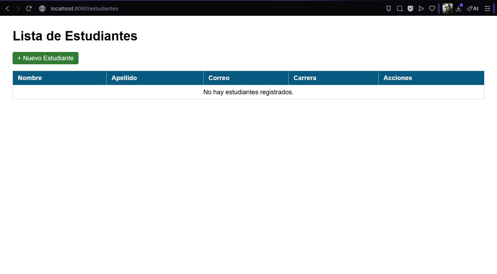
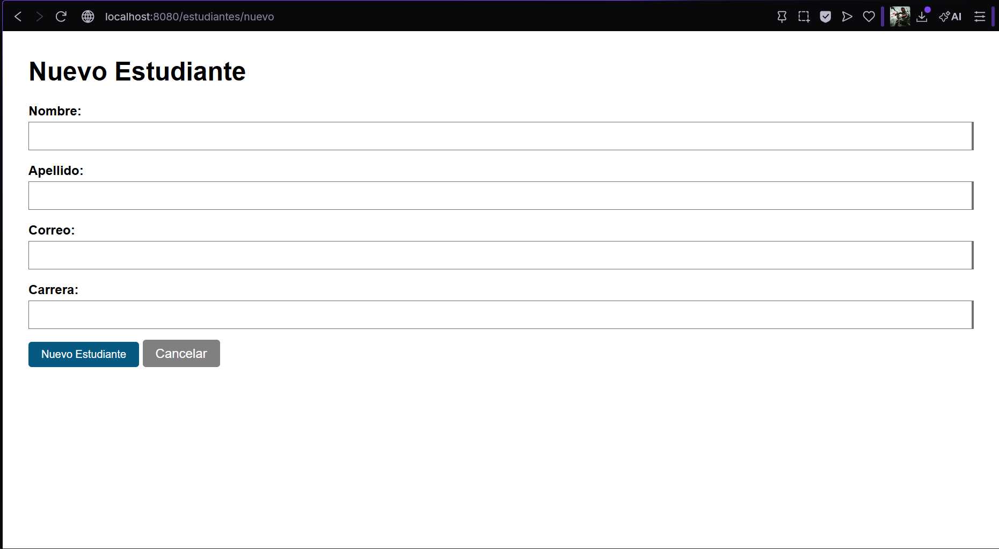
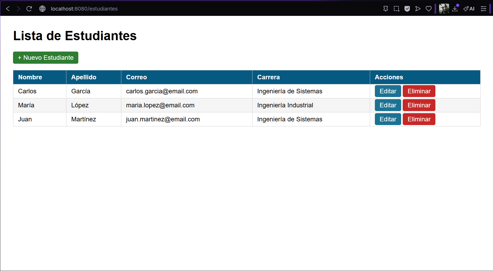
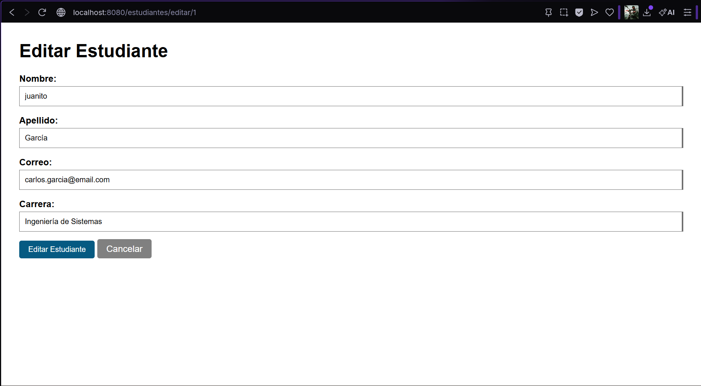
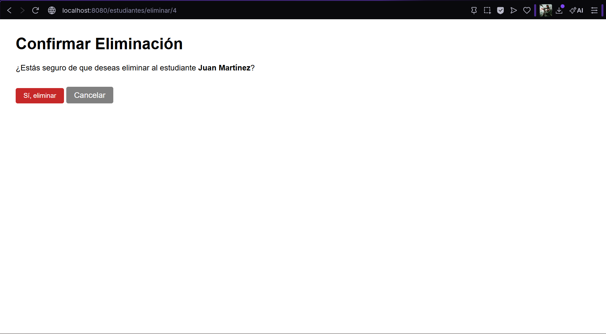
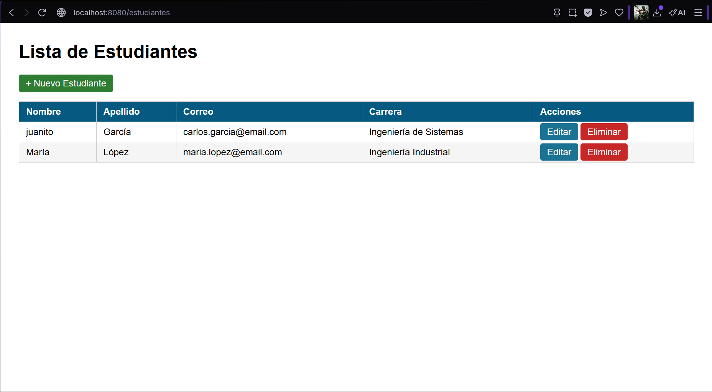

# Gestión de Estudiantes - Spring Boot + JPA/Hibernate + MySQL

Aplicación web CRUD para gestión de estudiantes desarrollada con Spring Boot, Spring Data JPA e Hibernate conectado a MySQL.
Proyecto correspondiente a la Unidad 8 (Post-Contenido 1) de Programación Web - Ingeniería de Sistemas 2026.

## Tecnologías utilizadas

- Java 17
- Spring Boot 3.2.x
- Spring Data JPA / Hibernate
- MySQL 8.x
- Thymeleaf
- Bean Validation (Jakarta Validation)
- Maven

## Estructura del proyecto

    src/main/java/com/universidad/estudiantes/
    ├── model/
    │   └── Estudiante.java             
    ├── repository/
    │   └── EstudianteRepository.java   
    ├── service/
    │   └── EstudianteService.java     
    ├── controller/
    │   └── EstudianteController.java   
    └── EstudiantesApplication.java      

    src/main/resources/
    ├── templates/estudiantes/
    │   ├── lista.html                   
    │   ├── formulario.html             
    │   └── confirmar-eliminar.html     
    └── application.properties

## Configuración de MySQL

**1. Crear la base de datos y el usuario**

Abrir MySQL Command Line Client y ejecutar:

    CREATE DATABASE estudiantes_db CHARACTER SET utf8mb4 COLLATE utf8mb4_unicode_ci;
    CREATE USER 'appuser'@'localhost' IDENTIFIED BY 'apppass';
    GRANT ALL PRIVILEGES ON estudiantes_db.* TO 'appuser'@'localhost';
    FLUSH PRIVILEGES;
    EXIT;

**2. Configuración en application.properties**

    spring.datasource.url=jdbc:mysql://localhost:3306/estudiantes_db?useSSL=false&serverTimezone=UTC&allowPublicKeyRetrieval=true
    spring.datasource.username=appuser
    spring.datasource.password=apppass
    spring.datasource.driver-class-name=com.mysql.cj.jdbc.Driver
    spring.jpa.hibernate.ddl-auto=update
    spring.jpa.show-sql=true

> Hibernate creará la tabla automáticamente al arrancar la aplicación gracias a ddl-auto=update.

## Cómo ejecutar el proyecto

**1. Clonar el repositorio**

    git clone https://github.com/Abrahan07/ProWeb-Remolina-post1-u8.git
    cd ProWeb-Remolina-post1-u8

**2. Asegurarse de que MySQL esté corriendo y la base de datos creada**

**3. Ejecutar la aplicación**

    ./mvnw spring-boot:run

**4. Abrir en el navegador**

    http://localhost:8080/estudiantes

> Requiere Java 17 o superior y MySQL 8.x instalados.

## Funcionalidades

| Ruta | Método | Descripción |
|------|--------|-------------|
| `/estudiantes` | GET | Lista todos los estudiantes |
| `/estudiantes/nuevo` | GET | Muestra formulario de creación |
| `/estudiantes/guardar` | POST | Guarda un estudiante nuevo o editado |
| `/estudiantes/editar/{id}` | GET | Muestra formulario prellenado |
| `/estudiantes/eliminar/{id}` | GET | Muestra confirmación de eliminación |
| `/estudiantes/eliminar/{id}` | POST | Elimina el estudiante |

## Validaciones implementadas

- Nombre: obligatorio, entre 2 y 100 caracteres
- Apellido: obligatorio
- Correo: obligatorio, formato válido de email, único en la base de datos
- Carrera: obligatoria

## Capturas de pantalla

### Lista de estudiantes

### Formulario de creación

### Lista con estudiantes creados

### Editar estudiante

### Confirmar eliminación

### Lista después de eliminar

